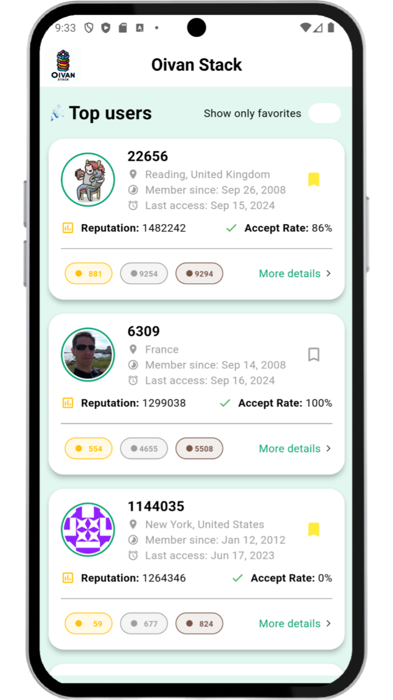
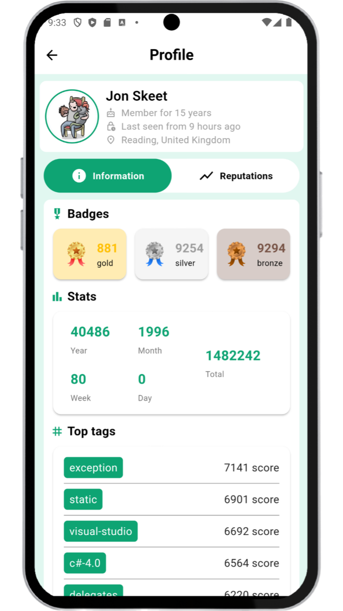

# Oivan Stack

Oivan Stack is a cross-platform mobile application built with [Flutter](https://flutter.dev) and [Dart](https://dart.dev). It allows users to explore and bookmark profiles from StackOverflow, offering smooth scrolling, persistent bookmarking capabilities, OAuth 2.0 authentication, and token storage. This project uses the latest features from **Flutter 3.22.0** and **Dart 3.4.0**.

# 🎯 Project Philosophy

The driving philosophy behind Oivan Stack is **user-centricity** and **performance optimization**. The goal is to provide users with a seamless experience when interacting with large data sets, such as the StackOverflow user database, without sacrificing speed or battery life.
The app is built for real-world use cases where features like token persistence, user bookmarking, and OAuth authentication are essential.

## Screenshots

Here are some screenshots of the Oivan Stack in action:




# 🧰 Tech Stack

Here’s a brief high-level overview of the tech stack the Oivan Stack app uses:

- This project uses the [Flutter app development framework](https://flutter.dev). Flutter is a cross-platform hybrid app development platform that allows us to use a single codebase for apps on mobile, desktop, and the web.
- For state management, the app uses the [Provider package](https://pub.dev/packages/provider), a simple yet powerful tool for managing the app's state across widgets efficiently.

- For HTTP requests and API calls, the app uses the [Dio package](https://pub.dev/packages/dio), which offers support for making network requests with ease and provides robust features such as interceptors, global configurations, and more.

- For OAuth 2.0 authentication, the app integrates [flutter_web_auth](https://pub.dev/packages/flutter_web_auth), a library that simplifies the process of managing web-based authentication flows.

- For persistent storage (bookmarked users), the app uses [Sqflite](https://pub.dev/packages/sqflite), allowing the app to save user bookmarks and other data in a local SQLite database.

- To store user tokens, the app uses [Shared Preferences](https://pub.dev/packages/shared_preferences), which provides a simple, persistent key-value store to save and retrieve tokens between app sessions.

- For rendering interactive charts, the app uses [fl_chart](https://pub.dev/packages/fl_chart), providing customizable charts and graphs to present data dynamically.

- The app also employs [retrofit](https://pub.dev/packages/retrofit) for generating API client code, making it easier to interact with REST APIs.

- To display and cache network images efficiently, the app uses [cached_network_image](https://pub.dev/packages/cached_network_image), allowing seamless image loading with caching support.

- To handle webview-based content, [flutter_inappwebview](https://pub.dev/packages/flutter_inappwebview) is used, offering advanced webview capabilities.

# ⚙️ Installation

1. **Prerequisites**:

   - Flutter 3.22.0
   - Dart 3.4.0
   - Android/iOS Emulator or a physical device

2. **Clone the Repository**:

   ```bash
   git clone https://github.com/your-username/oivan-stack.git
   cd oivan-stack
   ```

3. **Install Dependencies**:
   Run the following command to install the required dependencies:
   ```bash
   flutter pub get
   ```

## Running the App

To run the app on an emulator or a physical device, use the following command:

```bash
flutter run
```

For specific platforms:

- Android: `flutter run -d android`
- iOS: `flutter run -d ios`

## Quick Start

1. After cloning and installing the dependencies, ensure your environment has access to an Android/iOS emulator or a physical device.
2. Run `flutter pub get` to fetch all dependencies.
3. Use `flutter run` to start the app on your selected platform.
4. Explore the StackOverflow user list, scroll down to see more users, and bookmark your favorite profiles.
5. OAuth 2.0 authentication is used to access secure parts of the application, and tokens are stored using Shared Preferences for persistence.
6. Restart the app to see persistent bookmarks and token management!

# 🙏 Thank You

I would like to express my sincere gratitude to the **Oivan** team for giving me the opportunity to work on this test project. It was an exciting and enriching experience, and I appreciate the chance to showcase my skills in Flutter development. Your guidance and support throughout the process were invaluable.
